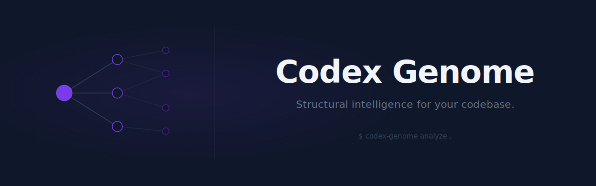
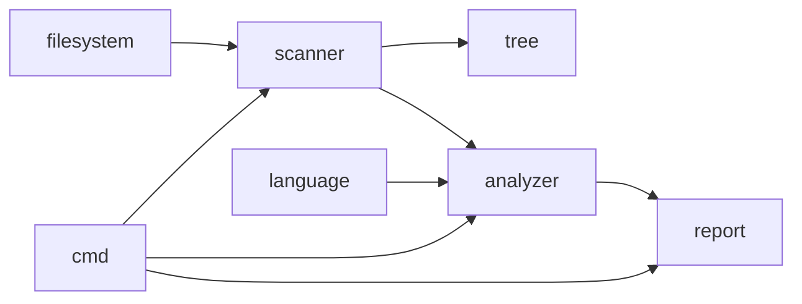

<div align="center">

[](https://github.com/codexgenome/codex-genome/actions/workflows/ci.yml)
[](go.mod)
[](LICENSE)

</div>

---

Codex Genome is a command-line tool for analyzing the structure and composition of software projects. Point it at a directory and it tells you what is there: file counts, language breakdown, directory layout — without reading a single line of source code.

---

## Why Codex Genome?

When you arrive at an unfamiliar codebase, the first question is structural: *what am I looking at?* How large is it? What languages? How is it organized?

Existing tools each solve part of this:

| Tool | What it does | What it does not cover |
|---|---|---|
| `find` + `wc` | Counts files | No language mapping, raw output |
| IDE project view | Visual file tree | Requires the project to be open in an IDE |
| `cloc` | Lines of code per language | No filesystem layout, no extension breakdown |
| GitHub language bar | Language percentages | Requires a push to GitHub, no local analysis |

Codex Genome runs locally, needs no configuration, and produces a structured terminal report in milliseconds.

## Features

**Filesystem scanning**
- Recursive directory walk with deterministic, lexicographic ordering
- Built-in ignore list: `.git`, `node_modules`, `vendor`, `dist`, `build`
- Graceful handling of permission-restricted entries

**Analysis**
- File extension breakdown with proportional bar chart
- Language detection across 30+ languages and configuration formats
- Language distribution with percentage share of total files
- Primary language identification

**Output**
- Structured terminal report with consistent visual hierarchy
- Cross-platform: Linux, macOS, Windows

## Installation

**Build from source** (Go 1.23+ required)

```bash
git clone https://github.com/codexgenome/codex-genome
cd codex-genome
go build -o codex-genome .
```

**Using go install**

```bash
go install github.com/codexgenome/codex-genome@latest
```

## Example

```
$ codex-genome analyze ~/projects/myapp

 ◈ Codex Genome  /home/user/projects/myapp
──────────────────────────────────────────────────────────────

  Total Files              62
  Total Directories         8

──────────────────────────────────────────────────────────────

  File Extensions

  .go                   42  █████████████░░░░░░░
  .ts                    8  ██░░░░░░░░░░░░░░░░░░
  .json                  5  █░░░░░░░░░░░░░░░░░░░
  .md                    4  █░░░░░░░░░░░░░░░░░░░
  .yaml                  3  ░░░░░░░░░░░░░░░░░░░░

──────────────────────────────────────────────────────────────

  Language Profile

  Primary Language      Go

  Go                    42  █████████████░░░░░░░  67.7%
  TypeScript             8  ██░░░░░░░░░░░░░░░░░░  12.9%
  JSON                   5  █░░░░░░░░░░░░░░░░░░░   8.1%
  Markdown               4  █░░░░░░░░░░░░░░░░░░░   6.5%
  YAML                   3  ░░░░░░░░░░░░░░░░░░░░   4.8%

  Total Languages        5

──────────────────────────────────────────────────────────────
  Completed in    4ms
```

## Architecture

Codex Genome is a pipeline. Each package has exactly one responsibility and data flows in one direction.



| Package | Responsibility |
|---|---|
| `filesystem` | Path resolution and validation |
| `scanner` | Recursive filesystem walk, domain models (`Project`, `File`, `Directory`) |
| `tree` | In-memory project tree construction |
| `language` | Extension-to-language name mapping |
| `analyzer` | Metric aggregation from scan results |
| `report` | Terminal output rendering |
| `cmd` | CLI command definitions and orchestration |

No package imports from a layer above it. The `tree` package is built and independent; it will be wired to the renderer in v0.2.

## Project Philosophy

**Separation of concerns.** The scanner discovers. The analyzer aggregates. The renderer displays. These are different jobs, and coupling them is how codebases become hard to change.

**No speculative code.** Every package solves a concrete, current problem. No TODO comments in source files. No planned-but-not-built features in the package tree.

**Honest output.** Codex Genome reports what it finds. It does not assign health scores, make recommendations, or weight results based on opinion.

**Standard library first.** Third-party dependencies are added only when the standard library cannot reasonably solve the problem. Current external dependencies: [Cobra](https://github.com/spf13/cobra) (CLI framework) and [Lipgloss](https://github.com/charmbracelet/lipgloss) (terminal styling).

**Incremental delivery.** Each pull request delivers one complete, working thing. No half-built engines, no temporary scaffolding left in place.

## Roadmap

### v0.1 — Foundation (current)

- [x] Recursive filesystem scanner with ignore rules
- [x] Domain models — `Project`, `File`, `Directory`
- [x] In-memory project tree
- [x] Language detection (30+ languages)
- [x] Extension distribution with bar chart
- [x] Language distribution with percentages and primary language

### v0.2 — Depth

- [ ] Gitignore-aware scanning
- [ ] Lines of code per language
- [ ] Tree view rendering (`--tree` flag)
- [ ] File size distribution

### v0.3 — Dependencies

- [ ] Go module dependency extraction (`go.mod` analysis)
- [ ] Import graph per package

### v0.4 — Output Formats

- [ ] JSON output (`--format json`)
- [ ] CSV output (`--format csv`)
- [ ] Silent mode for use in scripts

### v1.0 — Stable

- [ ] Stable CLI interface (no breaking changes after this point)
- [ ] Complete test suite with coverage reporting
- [ ] Configuration file (`.codexgenome.toml`)

## Contributing

See [CONTRIBUTING.md](CONTRIBUTING.md) for branching strategy, commit conventions, coding standards, and the PR process.

## License

MIT — see [LICENSE](LICENSE).
